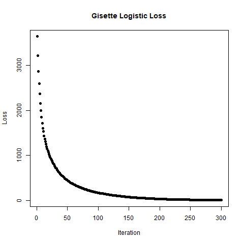
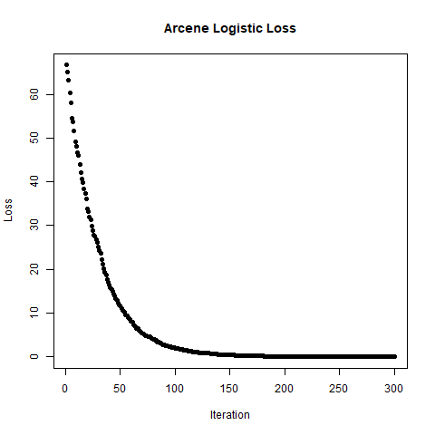
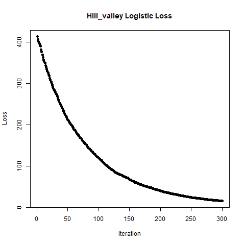
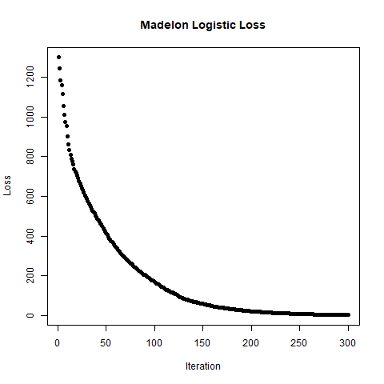

```{r setup, echo = FALSE, message = FALSE}
knitr::opts_chunk$set(echo = FALSE)
```

## Method

The "ada" package in R was used to run LogitBoost on four datasets. The ada function was modified to also return the loss so that it could be plotted. The plots below show the loss vs. iteration and misclassification error vs. iteration. A table of results is also included, as well as the script and a bibliography.

```{r}
library(ggplot2)
results <- readRDS("C:/Users/joh10/Desktop/FSU/FA17/5635/git/hw8/results.rds")
results_long <- tidyr::gather(results, "Set", "Error", 3:4)
```

## Gisette

R ran out of memory on full dataset, so a subset of 500 features was used for analysis. 

{width=350px}

```{r}
plotdat <- subset(results_long, Data == "gisette")
ggplot(plotdat) + geom_line(aes(k, Error, col = Set)) + 
  geom_point(aes(k, Error, col = Set)) + theme_bw() + ggtitle("Gisette Misclassification Error by Iteration")
```

## Arcene

R ran out of memory on full dataset, so a subset of 2000 features was used for analysis.



```{r}
plotdat <- subset(results_long, Data == "arcene")
ggplot(plotdat) + geom_line(aes(k, Error, col = Set)) + 
  geom_point(aes(k, Error, col = Set)) + theme_bw() + ggtitle("Arcene Misclassification Error by Iteration")
```

## Hill-Valley



```{r}
plotdat <- subset(results_long, Data == "hill_valley")
ggplot(plotdat) + geom_line(aes(k, Error, col = Set)) + 
  geom_point(aes(k, Error, col = Set)) + theme_bw() + ggtitle("Hill-Valley Misclassification Error by Iteration")
```

## Madelon



```{r}
plotdat <- subset(results_long, Data == "madelon")
ggplot(plotdat) + geom_line(aes(k, Error, col = Set)) + 
  geom_point(aes(k, Error, col = Set)) + theme_bw() + ggtitle("Madelon Misclassification Error by Iteration")
```


## Table of Results
```{r}
knitr::kable(results)
```

## Script

```{r eval = FALSE}
read_data <- function(filename, path = "C:/Users/joh10/Desktop/FSU/FA17/5635/git/Data/") {
  if (filename != "hill_valley") {
    X <- read.delim(paste0(path, filename, "/", filename, "_train.data"), sep = " ", header = FALSE)
    X <- X[,-ncol(X)]
    Y <- read.delim(paste0(path, filename, "/", filename, "_train.labels"), header = FALSE)
    colnames(Y) <- "Y"
    Xtest <- read.delim(paste0(path, filename, "/", filename, "_valid.data"), sep = " ", header = FALSE)
    Xtest <- Xtest[,-ncol(Xtest)]
    Ytest <- read.delim(paste0(path, filename, "/", filename, "_valid.labels"), header = FALSE)
    colnames(Ytest) <- "Y"
    if (filename %in% c("gisette", "arcene")) {
      ncols <- ifelse(filename == "gisette", 500, 2000)
      samp <- sample(ncol(X), ncols)
      X <- X[,samp]
      Xtest <- Xtest[,samp]
    }
    
  } else {
    X <- read.delim(paste0(path, filename, "/X.dat"), sep = " ", header = FALSE)
    Y <- read.delim(paste0(path, filename, "/Y.dat"), header = FALSE)
    colnames(Y) <- "Y"
    Xtest <- read.delim(paste0(path, filename, "/Xtest.dat"), sep = " ", header = FALSE)
    Ytest <- read.delim(paste0(path, filename, "/Ytest.dat"), header = FALSE)
    colnames(Ytest) <- "Y"
  }
  
  return(list(X = X, Y = Y, Xtest = Xtest, Ytest = Ytest))
}
```

```{r eval = FALSE, echo = TRUE}
## run logitboost
library(ada)
results <- data.frame()
set.seed(5)
files <- c("gisette", "arcene", "hill_valley", "madelon")
propcase <- function(string) {paste0(toupper(substring(string, 1, 1)), substring(string, 2))}
print(Sys.time())
for (i in 1:4) {
  message(paste("Begin", files[i]))
  filelist <- read_data(files[i])
  for (k in c(10, 30, 100, 300)) {
    logitBoost <- ada(filelist$X, filelist$Y$Y, filelist$Xtest, filelist$Ytest$Y,
                                  loss="logistic", iter=k, verbose = FALSE)
    if (k == 300) {
      png(filename = paste0("C:/Users/joh10/Desktop/FSU/FA17/5635/git/hw8/", files[i], "_loss.png"))
      plot(logitBoost$model$plot_loss, xlab = "Iteration", ylab = "Loss", 
                      main = paste0(propcase(files[i]), " Logistic Loss"), pch=16)
      dev.off()
      message("Plot saved.")
    }
    results <- rbind(results, c(k, logitBoost$model$errs[k,1], logitBoost$model$errs[k,3]))
    message(paste("k =", k, "finished"))
  }
  print(Sys.time())
}

colnames(results) <- c("k", "Training Error", "Testing Error")
results <- data.frame(Data = rep(files, each = 4), results)
saveRDS(results, "C:/Users/joh10/Desktop/FSU/FA17/5635/git/hw8/results.rds")
```

#### Modifying the ada function

The "trace" function in base R was used to modify the ada package so that the loss function could be plotted. 
```{r eval = FALSE, echo = TRUE}
trace(ada:::ada.default, edit = TRUE)
trace(ada:::ada.machine, edit = TRUE)

## code added:
# plot_loss <- c()
# plot_loss[m] <- sum(log(1 + exp(-y * fits)))
# add plot_loss to return obj

#untrace(ada:::ada.machine)
```

## Bibliography

* Mark Culp, Kjell Johnson and George Michailidis (2016). ada: The R Package Ada for Stochastic Boosting. R package version 2.0-5. https://CRAN.R-project.org/package=ada
* H. Wickham. ggplot2: Elegant Graphics for Data Analysis. Springer-Verlag New York, 2009.
* Hadley Wickham and Lionel Henry (2017). tidyr: Easily Tidy Data with 'spread()' and
  'gather()' Functions. R package version 0.7.2. https://CRAN.R-project.org/package=tidyr